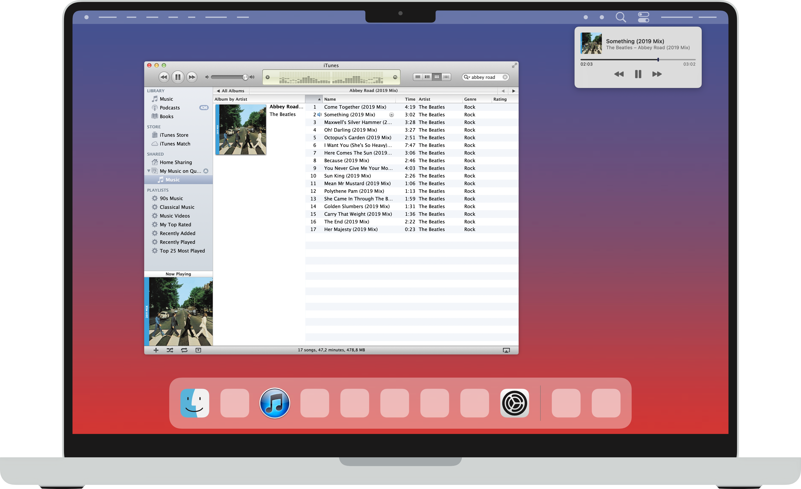
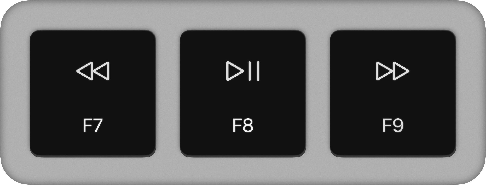

  
  <h1>iBridge</h1>
  
Control iTunes with your built in media keys and see now playing info in Control Center.

  
  

## Features
### Control Center Integration
Check what's blasting with now playing info in Control Center!

  

### Native Media Keys
No need to find iTunes just to skip to the next banger. Just hit the forward key!

  

### Designed for iTunes 10.7 and 11.4
Other versions haven't been tested, but they might work.

## Installation
1. Grab the newest version from [Releases](https://github.com/Mrosenhave/iBridge/releases).
2. Extract the .app to /Applications.
3. Right click iBridge.app and select open.
4. If you dont see an option to "Open Anyway" in the popup. Go to System Settings - Privacy & Security, scroll down and click "Open Anyway" there.

### Open on login
1. Go to System Settings - General - Login Items & Extensions.
2. Drag iBridge.app into the "Open at Login" list.

## To-Do
1. [ ] Implement seeking

## Compatability
 * macOS 11.5 Big Sur or newer
 * iTunes ver. 10.7 or 11.4 ([Install via Retroactive](https://github.com/cormiertyshawn895/Retroactive))
